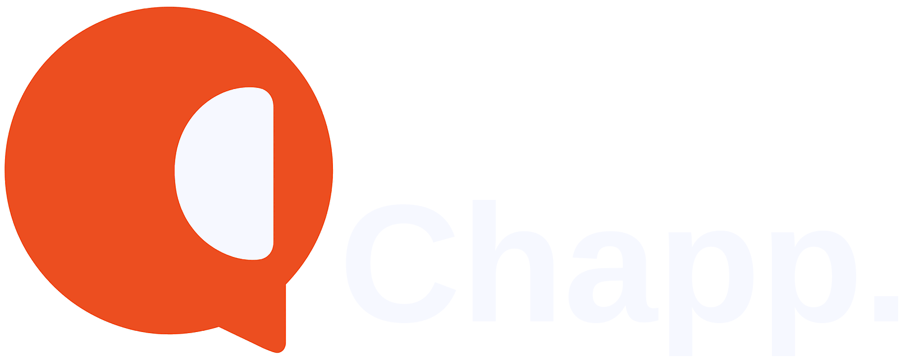
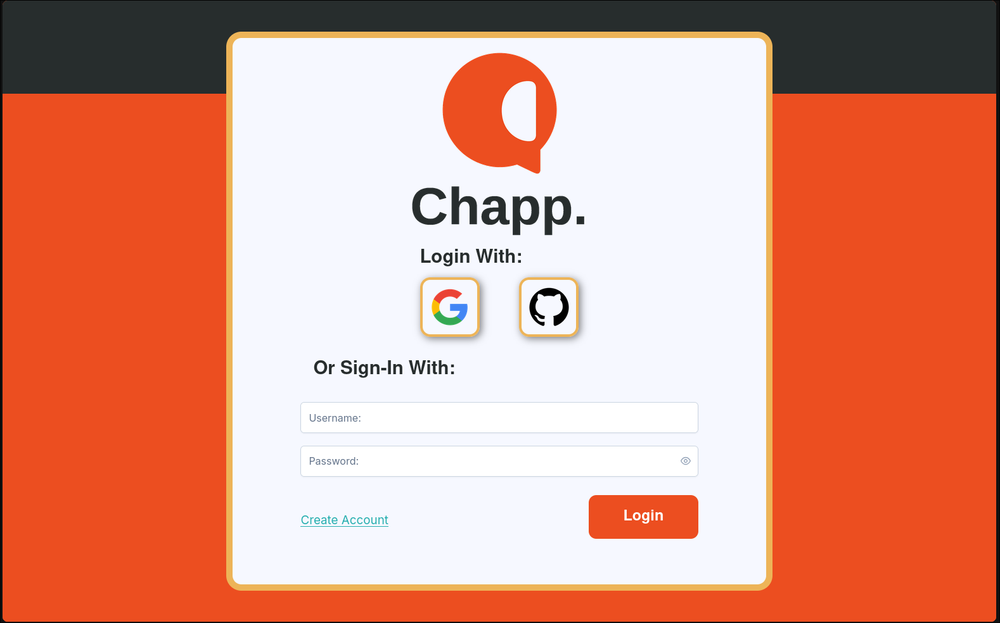
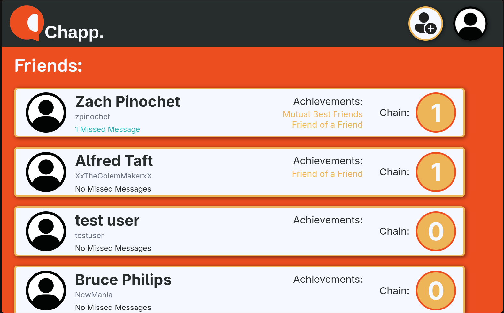
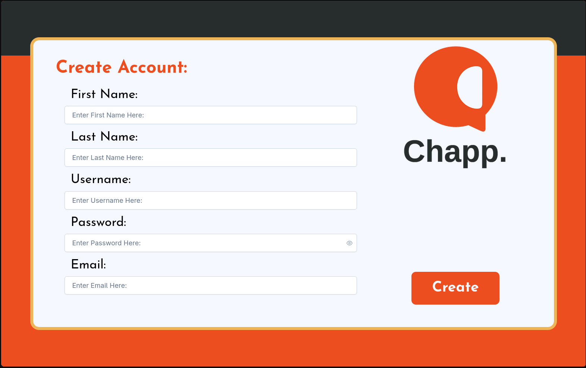
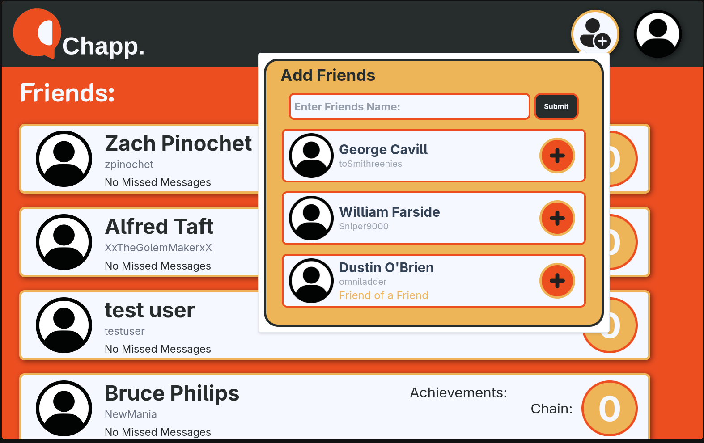
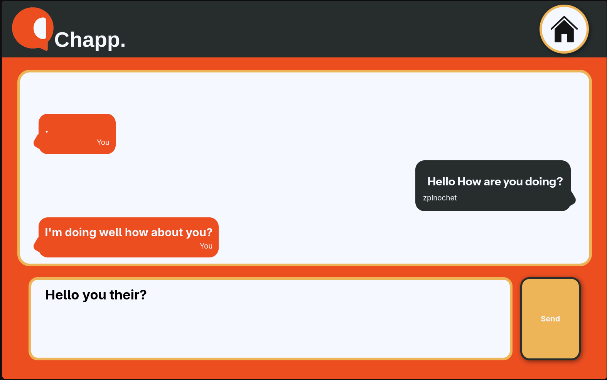
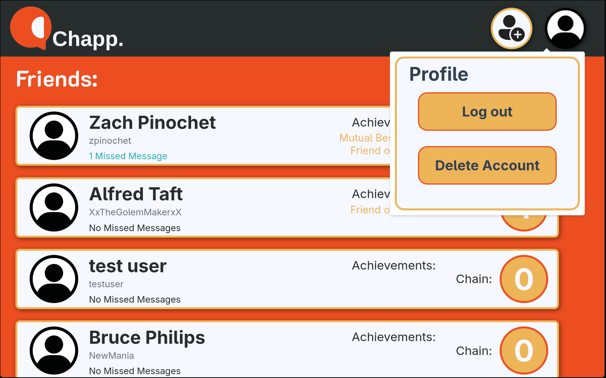

 
 
"*An Open-source Gamified Social Media Platform*"

# Table of Contents

- [Table of Contents](#Table-of-Contents)
- [Description](#Description)
- [Features](#Features)
- [Technologies](#Technologies)
- [Images](#Images)
- [Setup Guide](#Setup-Guide)
- [License](#License)

# Description
**Chapp.** is a Gamified Open-source Texting-based Social Media Platform in the sense that it allows for achievements and competitive elements with friends by tracking number of days in a row you've communicated and compeitive achievements to show who you and your friends have been talking too. Loosely based on Snapchat Chapp. Differentiates itself with a PC and text oriented design allowing texting on the computer while maintaining a responsive design for those on mobile as well as an increased accuracy in achivement status. Its open-source nature also allows for private hosting and internal usage among friend groups as well as allowing for modified versions of the program. Designed to both be a learning experience as well as valuable Chapp. utilizes Javascript as its complete stack utilzing npm as well as Express.JS and utilizes Docker and a growing number of other Infrastructure based tools to make running your own server as simple as possible.

 

**View The Site At:** [https://chapp.dustintobrien.com](https://chapp.dustintobrien.com)

# Features

- Account Creation, Deletion, and Managements
- Simple Friend Request and Deletion System
- Accurate achievements displaying relationship aspects
- Simple intuitive texting interface
- Responsive Design for Cross-platform usage
- OAuth with Github and Google Support
- Redis Based Caching
- Complete Modular and Containerized Infrastructure
- Rate Limited Messaging to Minimize Spamming
- Early K8s and Scalability Support
- Colorful & Easy to Read User Interface
- Range of Hosting Options (Native, Docker Compose, K8s)
- Github Actions CI/CD Testing

# Technologies

- **Frontend**
    - Angular
    - Typescript
    - Javascript
    - TailwindCSS 
    - HTML
    - PostCSS

- **Backend**
    - Node.JS
    - Express.JS
    - Typescript
    - Express Session
    - Javascript
    - Sequelize
    - Rest API

- **Database** 
    - PostgreSQL
    - SQL
    - Sequelize

- **DevOps / Infrastructure** 
    - Docker
    - Docker Compose
    - Redis
    - Github Actions
    - Kubernetes / k8s
    - Proxmox
    - Shell
    - Nginx
    - YAML

# Images 

    
Pictures

    <h2>Login Screen</h2>
        
    <h2>Home Screen</h2>
        
    <h2>Create Account Screen</h2>
        
    <h2>Add Friend Menu</h2>
        
    <h2>Chat Screen</h2>
        
    <h2>Profile Menu</h2>
        

 

# Setup Guide
WIP

 

# Future Goals

- Terraform based Cloud Deployment
- Stop Container Startup DB Migration
- Web Socket Based Messaging System
- Accurate and Easy to Use Setup Guide

# License

This project is licensed under the MIT License - see the [LICENSE](LICENSE) file for details

